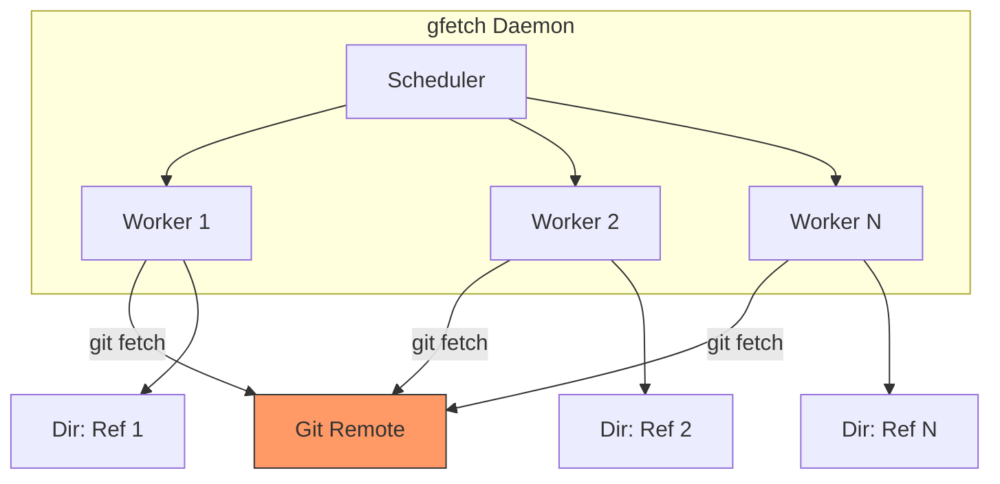
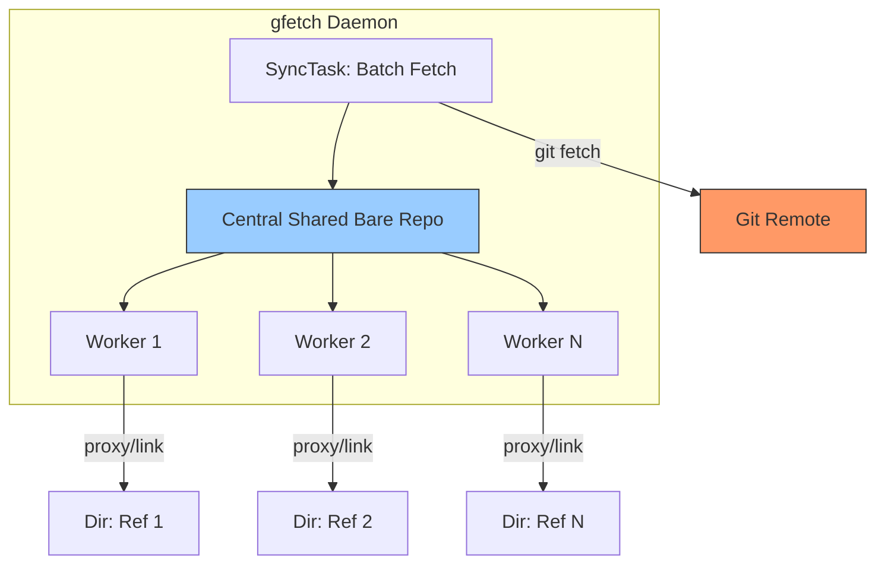

# Migration to Git Worktrees

## 1. Problem Statement

The current implementation of `gfetch` in `OpenVox` mode incurs severe performance degradation when syncing repositories with high branch/tag counts. Each worker performs an independent, full network `git fetch` for every ref, leading to redundant upstream traffic, intense disk I/O, and massive object duplication.

## 2. Current Architecture

In the current design, every ref synchronization is an isolated, self-contained Git clone.

### Technical Limitations

* Redundant Fetches: $N$ refs $\approx N$ network round-trips.
* Object Duplication: $N$ independent .git directories, each storing identical blob data.
* I/O Bottleneck: High contention on disk during concurrent pack-file processing.

## 3. Proposed Architecture: Shared Object Store

We will shift to a **Centralized Object Cache** model. All ref-specific repositories will leverage a single bare repository to handle object fetching, while maintaining isolated working trees.

## 4. Performance Quantification

| Metric | Current Approach | Proposed Approach |
| :--- | :--- | :--- |
| **Network Requests** | $O(N)$ | $O(1)$ (Batch) |
| **Disk Usage** | High (Duplicated) | Low (Shared Objects) |
| **I/O Contention** | High | Minimal |

* **Estimated Improvement:** Based on typical Git repository structures, reducing network round-trips by $N$ will reduce sync time by at least 60-80% for repositories with many refs, as the overhead of Git protocol negotiation is moved to a single centralized process.

## 5. Implementation Strategy

### 5.1. Centralized Bare Repository

* Create a hidden bare repository (e.g., `.gfetch-meta/cache.git`) within the `local_path`.
* All sync operations will trigger an update in this central bare repository first.

### 5.2. `go-git` Storage Proxy

* Instead of a full `PlainInit` in ref-specific directories, we will implement a custom `storage.Storer` interface.
* This proxy will serve object lookups by querying the Central Bare Repo (`cache.git`) first.
* The ref-specific directory will only store its unique reference (`refs/heads/...`) and its working tree.

### 5.3. Locking & Synchronization Strategy

To ensure data integrity, we will move to a two-tier locking system:

1. **Global Cache Lock (Exclusive):** Acquired only during the `git fetch` process for the Central Bare Repo.
2. **Per-Ref Lock (Shared/Exclusive):** Acquired by individual workers during the checkout phase to update their local refs and working trees based on the newly fetched objects in the Central Cache.

## 6. Benchmarking Plan

Before proceeding to implementation, we will benchmark the proposed changes:

1. **Measure Baseline:** Capture time-per-repo using the current `OpenVox` implementation.
2. **Simulate Centralized Cache:** Create a synthetic test where refs share a local object store and measure the checkout time.
3. **Validate:** Confirm that the overhead of the `storage.Storer` proxy is negligible compared to the network fetch savings.

## 7. Risks & Mitigation

* **Lock Contention:** A single central cache could become a bottleneck if fetch operations take long.
  * *Mitigation:* Keep fetches short-lived. Use atomic operations for Git reference updates.
* **Data Consistency:** If the Central Cache is corrupted, all refs are impacted.
  * *Mitigation:* Implement "Self-Healing": If a ref lookup fails, the worker attempts a `git fsck` or forces a refresh of the central cache.
